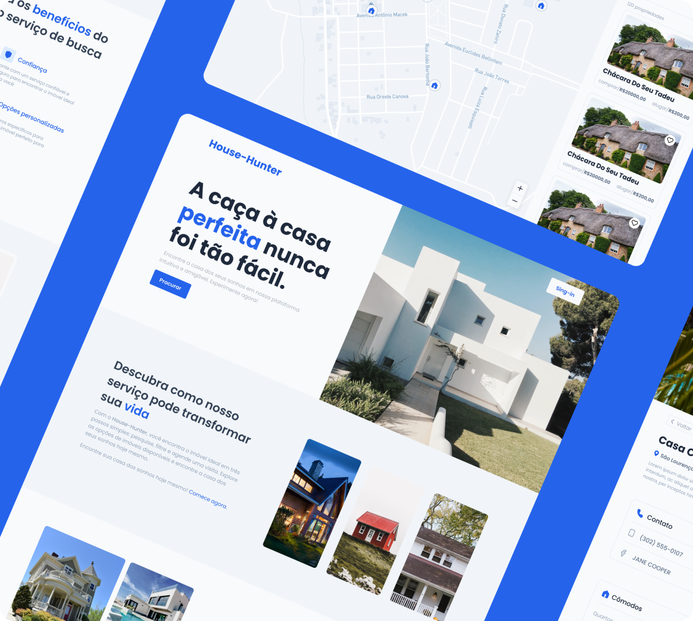

# House-Hunter

  <a href="#-tecnologias">Tecnologias</a>&nbsp;&nbsp;&nbsp;|&nbsp;&nbsp;&nbsp;
  <a href="#-projeto">Projeto</a>&nbsp;&nbsp;&nbsp;|&nbsp;&nbsp;&nbsp;
  <a href="#memo-licença">Licença</a>

 

## 🚀 Tecnologias

Esse projeto foi desenvolvido com as seguintes tecnologias:

#### Front-end
- Next
- Sass
- Typescript
- React-Query
- leaflet

### Back-end
- Node
- Typescript
- Prisma
- Postgresql

## 💻 Projeto

O projeto House-Hunter é uma plataforma dedicada à divulgação de casas disponíveis para venda ou aluguel. Com o objetivo de simplificar e agilizar o processo de busca por moradias, o House-Hunter oferece uma interface intuitiva e recursos avançados para ajudar os usuários a encontrar a casa dos seus sonhos.

## 📝 Licença

Esse projeto está sob a licença MIT. Veja o arquivo [LICENSE](.github/license.md) para mais detalhes.

---

Feito com ♥ by Aldovani :wave:
